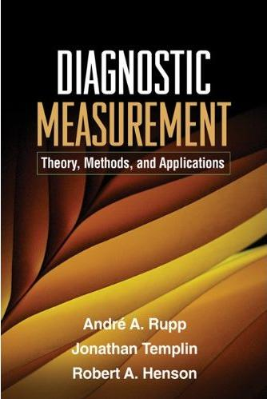

# Welcome {.unnumbered}

{fig-alt="Book cover: Diagnostic Measurement: Theory, Methods, and Applications" width="200"}

We welcome you to the website we have created to supplement our book, *Diagnostic Measurement: Theory, Methods, and Applications*.

This website is intended to supplement material in the book by providing additional content and updates to the text. When used in concert with the text, we hope the website will be a useful reference for diagnostic measurement in general, and more specifically, diagnostic classification models.

On the pages of this site you will find more information about our book, additional materials (such as Mplus syntax), and updates to the text due to errors we have made. If you have any questions, please do not hesitate to contact any of the three of us using our contact information.

Sincerely,

André, Jonathan, and Robert

---

## Table of Contents

See the [book table of contents (PDF)](files/dcmtoc.pdf).

## Citing the book

> Rupp, A. A., Templin, J., & Henson, R. A. (2010). *Diagnostic measurement: Theory, methods, and applications.* New York, NY: Guilford Press.
